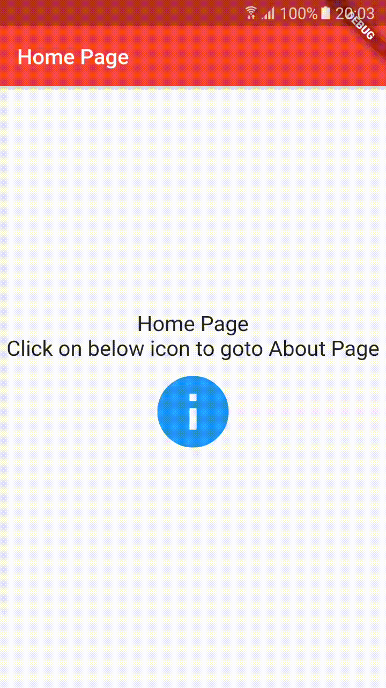

# Handling Routes

Mobile apps typically reveal their contents via full-screen elements called "screens" or "pages". In Flutter these elements are called routes and they're managed by a Navigator widget. The navigator manages a stack of Route objects and provides methods for managing the stack, like Navigator.push and Navigator.pop.

Read [[Documentation](https://docs.flutter.io/flutter/widgets/Navigator-class.html)]

## Getting Started

This project is a starting point for a Flutter application.

A few resources to get you started if this is your first Flutter project:

- [Lab: Write your first Flutter app](https://flutter.dev/docs/get-started/codelab)
- [Cookbook: Useful Flutter samples](https://flutter.dev/docs/cookbook)

For help getting started with Flutter, view our 
[online documentation](https://flutter.dev/docs), which offers tutorials, 
samples, guidance on mobile development, and a full API reference.
